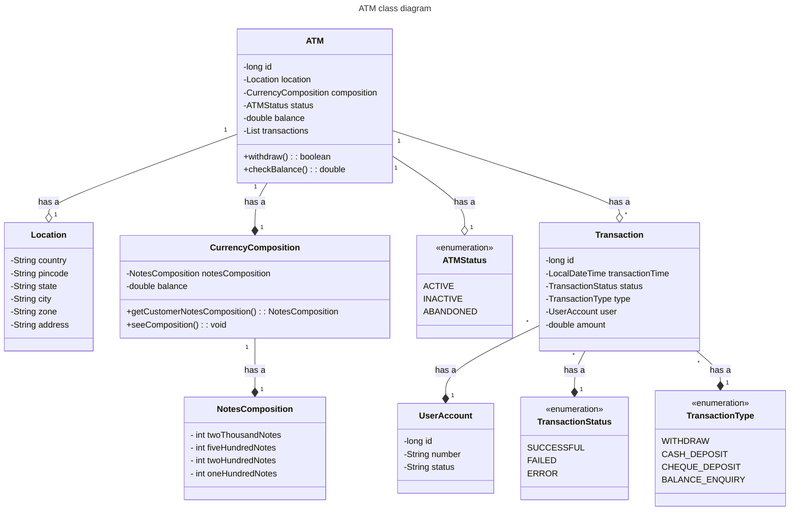

```mermaid
---
title: ATM class diagram
---
classDiagram

    ATM "1" --o "1" Location : has a
    ATM "1" --* "1" CurrencyComposition : has a
    ATM "1" --o "1" ATMStatus : has a
    CurrencyComposition "1" --* "1" NotesComposition : has a
    Transaction "*" --* "1" UserAccount : has a
    Transaction "*" --* "1" TransactionStatus : has a
    Transaction "*" --* "1" TransactionType : has a
    

    ATM "1" --o "*" Transaction : has a


    class ATM{
        -long id
        -Location location
        -CurrencyComposition composition
        -ATMStatus status
        -double balance
        -List<Transactions> transactions

        +withdraw() : boolean
        +checkBalance(): double
    }

    class Location{
        -String country
        -String pincode
        -String state
        -String city
        -String zone
        -String address
    }

    class CurrencyComposition{
        -NotesComposition notesComposition
        -double balance

        +getCustomerNotesComposition() : NotesComposition
        +seeComposition() : void
    }

    class NotesComposition {

        - int twoThousandNotes
        - int fiveHundredNotes
        - int twoHundredNotes
        - int oneHundredNotes
    }

    class ATMStatus{
        <<enumeration>>
        ACTIVE
        INACTIVE
        ABANDONED
    }

    class TransactionStatus{
        <<enumeration>>
        SUCCESSFUL
        FAILED
        ERROR
    }

    class TransactionType{
        <<enumeration>>
        WITHDRAW
        CASH_DEPOSIT
        CHEQUE_DEPOSIT
        BALANCE_ENQUIRY
    }

    class UserAccount{
        -long id
        -String number
        -String status
    }

    class Transaction{
        -long id
        -LocalDateTime transactionTime
        -TransactionStatus status
        -TransactionType type
        -UserAccount user
        -double amount

    }
```