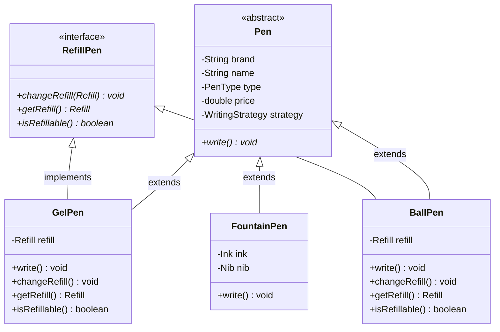

```mermaid
classDiagram
    class Pen {
        <<abstract>>
        -String brand
        -String name
        -PenType type
        -double price
        -WritingStrategy strategy
        +write()* void
    }
    
    class RefillPen {
        <<interface>>
        +changeRefill(Refill)* void
        +getRefill()* Refill
        +isRefillable()* boolean
    }
    
    class GelPen {
        -Refill refill
        +write() void
        +changeRefill() void
        +getRefill() Refill
        +isRefillable() boolean
    }

    class BallPen {
        -Refill refill
        +write() void
        +changeRefill() void
        +getRefill() Refill
        +isRefillable() boolean
    }
    
    class FountainPen {
        -Ink ink
        -Nib nib
        +write() void
    }
    Pen <|-- GelPen : extends
    RefillPen <|-- GelPen : implements
    
    Pen <|-- BallPen : extends
    RefillPen <|-- BallPen  : implements
    
    Pen <|-- FountainPen : extends


```