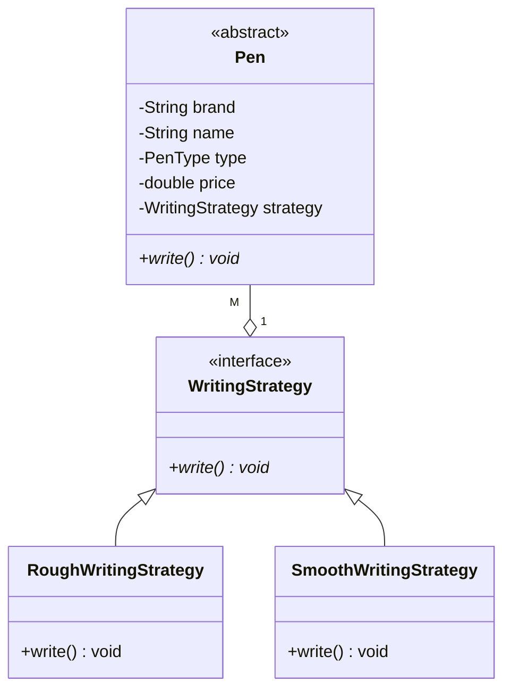

```mermaid
classDiagram
    class Pen {
        <<abstract>>
        -String brand
        -String name
        -PenType type
        -double price
        -WritingStrategy strategy
        +write()* void
    }
    
    class WritingStrategy {
        <<interface>>
        +write()* void
    }
    
    class RoughWritingStrategy {
            +write() void
    }
 
    class SmoothWritingStrategy {
            +write() void
    }

    WritingStrategy <|-- RoughWritingStrategy    
    WritingStrategy <|-- SmoothWritingStrategy
    
    Pen "M" --o "1" WritingStrategy

```