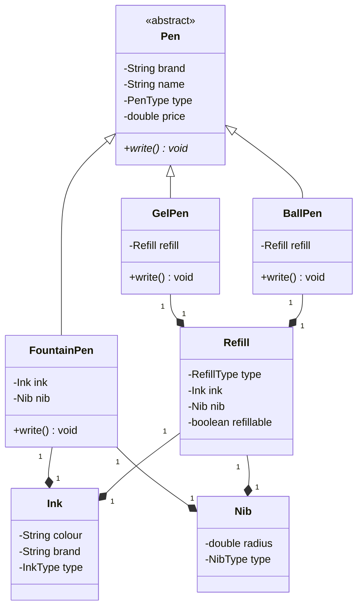

```mermaid
classDiagram
    class Pen {
        <<abstract>>
        -String brand
        -String name
        -PenType type
        -double price
        +write()* void
    }
    
    class GelPen {
        -Refill refill
        +write() void
    }
    
    class BallPen {
        -Refill refill
        +write() void
    }

    class FountainPen {
        -Ink ink
        -Nib nib
        +write() void
    }
    
    Pen <|-- GelPen
    Pen <|-- BallPen
    Pen <|-- FountainPen
        
    class Refill {
        -RefillType type
        -Ink ink
        -Nib nib
        -boolean refillable
    }


    class Ink {
        -String colour
        -String brand
        -InkType type
    }


    class Nib {
        -double radius
        -NibType type
    }

    
    GelPen "1" --* "1" Refill
    BallPen "1" --* "1" Refill
    FountainPen "1" --* "1" Ink    
    FountainPen "1" --* "1" Nib
    Refill "1" --* "1" Ink
    Refill "1" --* "1" Nib    

```