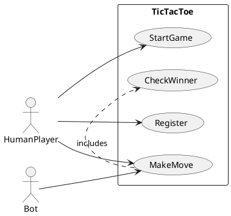

```plantuml
@startuml
left to right direction

actor HumanPlayer
actor Bot

rectangle TicTacToe {
    HumanPlayer --> (Register)
    HumanPlayer --> (StartGame)
    HumanPlayer --> (MakeMove)
    
    Bot --> (MakeMove)
    
    (MakeMove) .> (CheckWinner) : includes
}
@enduml
```